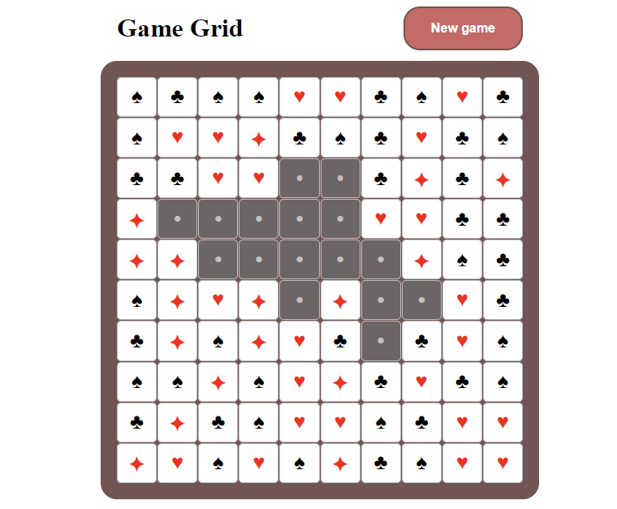

# ♠️ Game Grid JavaScript

This JavaScript code represents a game board with the functionality to generate a grid of cells, handle cell clicks, and remove connected cells with the same value. The code is written in vanilla JavaScript and includes a simple UI button to start a new game.

## 🚀 Preview

Link to preview:https://lanavol.github.io/game-grid/

## Key Requirements

1. **Object-Oriented Programming (OOP):** The code is structured using OOP principles. The Board class encapsulates the game logic, and each instance represents a game board.
1. **Build Tools:** Used Webpack for the task automation and workflow development.

## Features

- **Generate Grid**: The `generateGrid` method creates a grid of cells with random values and suits. Each cell represents a playing card.

- **Handle Cell Clicks**: The `getValueClickedCell` method handles the click event on a cell, initiating the removal of connected cells with the same value.

- **Remove Connected Cells**: The `removeConnectedCells` method removes connected cells with the same value recursively. A delay of 100 milliseconds is added between each recursive call for a visual effect.

- **New Game Button**: The code includes a "New game" button that resets the grid when clicked.
